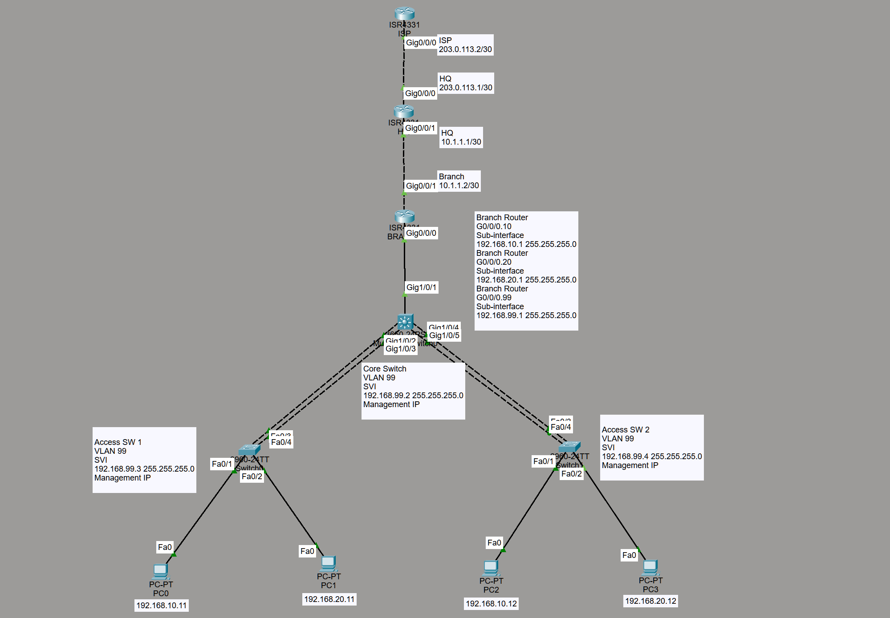
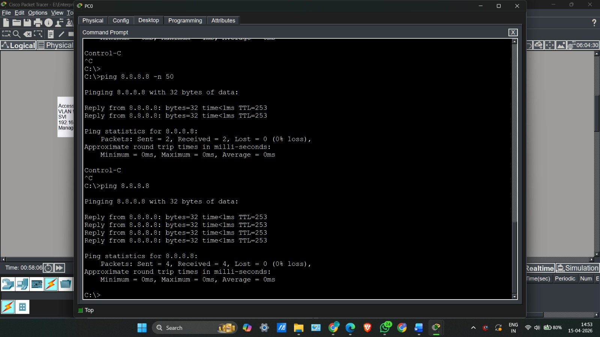
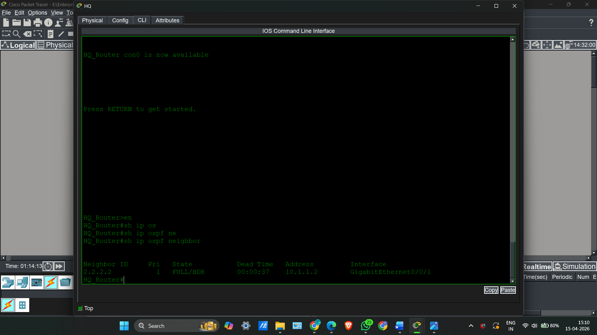
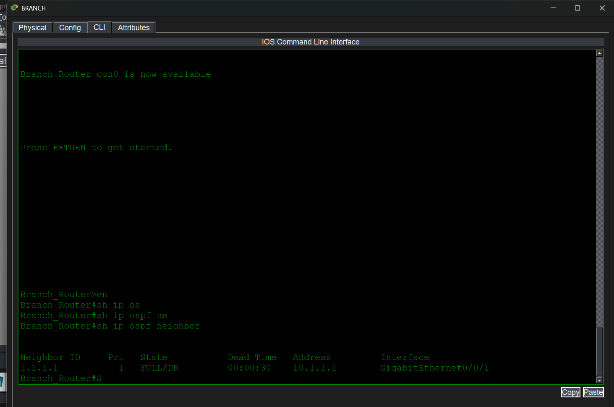
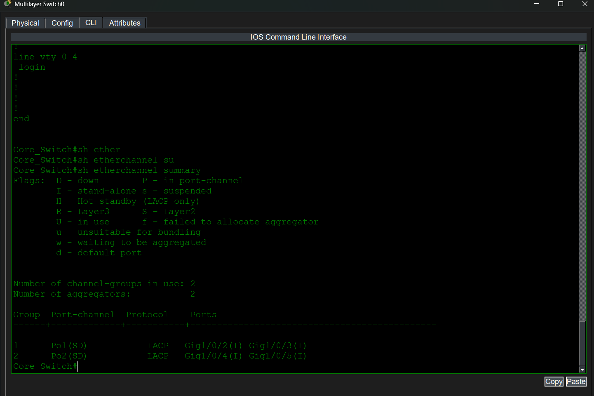

# Enterprise Branch Office Infrastructure Simulation

## 📌 Project Overview
Designed and configured a scalable enterprise network simulation using Cisco Packet Tracer. This project demonstrates core networking principles including Layer 2 segmentation, high availability, dynamic routing, and network security. This repository contains the device configurations, topology, and verification artifacts.

## 🛠 Technologies & Protocols Used
* **Routing:** Single-Area OSPFv2, Router-on-a-Stick (ROAS), Static/Default Routing
* **Switching:** VLANs, 802.1Q Trunking, EtherChannel (LACP), Rapid PVST+
* **Services:** DHCP, NAT/PAT (Overload)
* **Security:** Extended Access Control Lists (ACLs)

## 🏗️ Network Topology
This simulation mimics a real-world enterprise branch connecting to a headquarters and out to the public internet.

## 🚀 Configuration Highlights
The full CLI configurations for all devices can be found in the [`/Configs`](Configs/) directory.

* **VLAN Segmentation:** Configured VLANs 10 (Data), 20 (Voice), and 99 (Management) to logically separate broadcast domains across the Access and Core layers.
* **Link Aggregation:** Bundled dual uplinks between the Core and Access switches using LACP (802.3ad) to provide Layer 2 redundancy and increased bandwidth.
* **Dynamic Routing:** Implemented single-area OSPFv2 for dynamic route learning and fast convergence between the Branch and HQ routers.
* **NAT Overload:** Configured Port Address Translation (PAT) on the HQ router to allow internal private IP addresses to securely access the simulated public internet.
* **Traffic Filtering:** Applied an Extended ACL on the Branch router to restrict unauthorized lateral movement between the Data and Voice VLANs.

## ✅ Verification & Testing
The network was rigorously tested to ensure end-to-end connectivity, routing convergence, and security compliance. 

### 1. End-to-End Connectivity (NAT & Routing)
Successful ICMP reachability from an end-user PC on VLAN 10 out to the simulated public internet (8.8.8.8), proving DHCP, inter-VLAN routing, and NAT are fully operational.

### 2. OSPF Neighbor Adjacencies
Verification that the HQ and Branch routers have successfully formed OSPF neighbor adjacencies and are dynamically exchanging routes.
**HQ Router:**

**Branch Router:**

### 3. EtherChannel Status
Verification of the LACP Port-Channels on the Core Switch showing links are actively bundled and functioning at Layer 2.

